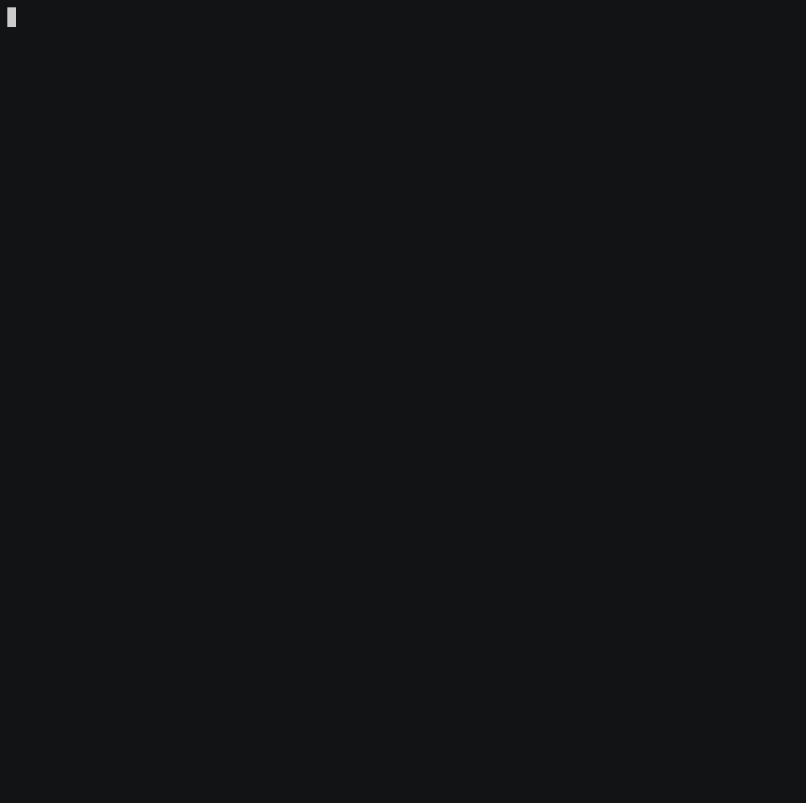

# nprr
nprr: npm run + autocomplete 🚀

> TL;DR: install it with `$ npm i -g nprr`, run it with `$ nprr`. If you want, [add an alias](#shortcut).

 [](https://travis-ci.com/NoriSte/nprr) [](https://coveralls.io/github/NoriSte/nprr?branch=feature/nprr) [](https://stryker-mutator.github.io) [](https://travis-ci.com/NoriSte/nprr)
<br />[](https://renovatebot.com/) [](http://commitizen.github.io/cz-cli/) [](https://github.com/semantic-release/semantic-release) [](https://github.com/ellerbrock/open-source-badge/) [](https://snyk.io/test/github/noriste/nprr)

<!-- $ docker run --rm -v $PWD:/data asciinema/asciicast2gif https://asciinema.org/a/274468.json demo.gif to generate a gif from the asciinema video -->
[](https://github.com/NoriSte/nprr)
*Watch the [video on asciinema](https://asciinema.org/a/274468)*

## What is nprr?


Nprr is an `npm run` enhancer! It runs the good `npm run` programmatically (through `npm.run()`, not `child_process.exec()`) or let you choose the script to launch with autocomplete.

## Features

- runs a script the same way `npm run` would do
- `$ nprr` reads the package.json scripts and let you choose the script to run with autocomplete
- `$ nprr te` filters all the scripts containing `te` and lets you choose the script to run with autocomplete
- `$ nprr test` runs directly any existing script (ex. `test`)

## Examples
Imagine your package.json contains the following scripts:

```json
{
  "scripts": {
    "test": "...",
    "test:unit": "...",
    "test:e2e": "...",
    "build:production": "...",
    "build:staging": "...",
    "commit": "..."
  }
}
```

- `$ nprr` presents an autocomplete with all the available scripts
- `$ nprr te` presents an autocomplete with all the scripts containing "te" ("test", "test:unit", "test:e2e")
- `$ nprr test` launches directly `npm run test`

## Command options

All the scripts can be launched with options too, all the next examples chain `op1 op2` to the executed script, just after the autocomplete (or exact match) process:
- `$ nprr -- op1 op2`
- `$ nprr te -- op1 op2`
- `$ nprr te op1 op2`
- `$ nprr test -- op1 op2`
- `$ nprr test op1 op2`


## Installation

`npm i -g nprr`

## FAQ

<span id="shortcut"></span>
#### Could it be aliased to something shorter like "npr" or even "r"?
Yep! All the bin names are stored in `/usr/local/bin` and if you open it you can find the "nprr" symlink as long as the "npm" one (and "npx", etc.). All you need to do is duplicating it by running:

`$ cp -a /usr/local/bin/nprr /usr/local/bin/YOUR_SHORTCUT` (replace "YOUR_SHORTCUT" with "npr", "r" or whatever you want)

If you change your mind and you want to remove the new shortcut, do not worry: remove it by running

`$ rm /usr/local/bin/YOUR_SHORTCUT`

#### How does it work?
Read the dedicated article, both on [Medium](https://medium.com/@NoriSte/launching-npm-run-programmatically-with-npm-run-f2a1b8a569a6) or [dev.to](https://dev.to/noriste/launching-npm-run-programmatically-with-npm-run-3mmc).

#### Could I use nprr programmatically?
Certainly! The script below leverages nprr and gets the arguments passed to `nprr.run()` (please, do not forget to install nprr locally with `npm i -D nprr`)
```js
const nprr = require("nprr");
nprr("test").then(argv => {
  console.log(argv);
});
```
Nprr accepts an array of strings or a string as the only argument.

#### Is it possible to edit the filter passed to nprr?
Unfortunately not but I'd love to add it as soon as possible. Nprr leverages [Enquirer](https://github.com/enquirer/enquirer) but, at the moment, it does not allow to do that, see the [related issue](https://github.com/enquirer/enquirer/issues/66) (and [Inquirer](https://github.com/SBoudrias/Inquirer.js/) can do that [neither](https://github.com/SBoudrias/Inquirer.js/issues/590)).

#### Could npm allow for both autocomplete and fuzzy search?
At the moment the fuzzy search is not supported. I need to investigate how it could be done with Enquirer/Inquirer.

#### Snyk reports that nprr has a vulnerability...
It's with NPM itself, [take a look](https://snyk.io/test/github/noriste/nprr).

### Why did you call it nprr?
Because "npr" has [already been used](https://www.npmjs.com/package/npr) on NPM.

### Why did not you call it npra (npr + autocomplete)?
Because "nprr" is faser to be typed compared to "npra".

#### Does a less-obtrusive solution exist to list the package.json scripts without opening it?
Yes, it's the built-in [npm-completion](https://docs.npmjs.com/cli/completion).

#### How could I record a video of a terminal session like you did with the opening gif?
Use [asciinema](https://asciinema.org/). If you want to generate a GIF, make the video public and convert it launching `$ docker run --rm -v $PWD:/data asciinema/asciicast2gif https://asciinema.org/a/VIDEOID.json video.gif`.

### Notes
The E2E tests are run directly with Travis, take a look at the [`.travis.yml`](./.travis.yml) file.


## Contributors ✨

Thanks goes to these wonderful people ([emoji key](https://allcontributors.org/docs/en/emoji-key)):

<!-- ALL-CONTRIBUTORS-LIST:START - Do not remove or modify this section -->
<!-- prettier-ignore -->
<table>
  <tr>
    <td align="center"><a href="https://twitter.com/NoriSte"><br /><sub><b>Stefano Magni</b></sub></a><br /><a href="https://github.com/NoriSte/nprr/commits?author=NoriSte" title="Code">💻</a> <a href="#docs-NoriSte" title="Docs">📖</a> <a href="#content-NoriSte" title="Content">🖋</a> <a href="#example-NoriSte" title="Examples">💡</a> <a href="#ideas-NoriSte" title="Ideas, Planning, & Feedback">🤔</a></td>
  </tr>
</table>

<!-- ALL-CONTRIBUTORS-LIST:END -->

This project follows the [all-contributors](https://github.com/all-contributors/all-contributors) specification. Contributions of any kind welcome!
